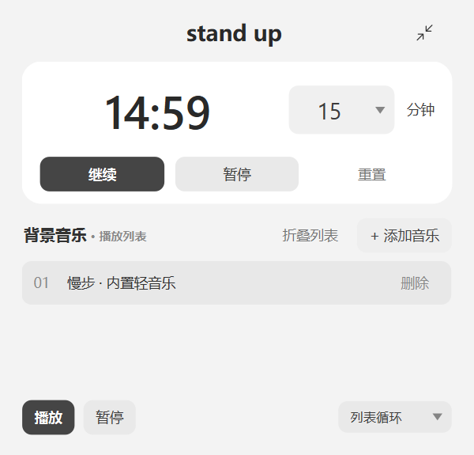
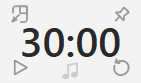

# stand up

一个提醒你起身活动的 Windows 桌面倒计时工具，支持本地背景音乐与迷你浮窗。


## 下载使用

从本仓库的 **Releases** 下载 `stand-up-windows-x64.zip`，解压后双击 `stand up.exe`。
适用于 Windows 10/11 64 位，无需安装 Python。当前版本未进行数字签名。



### 倒计时

- 快捷选择 15、30、45、60 分钟，默认 30 分钟。
- 可以直接输入 1～999 的整数分钟，点击“开始”即可使用新时长；暂停后点“继续”保留进度，点“重置”则采用当前输入时长。
- 计时过程中可暂停、继续；重置会停止计时并恢复当前所选时长。
- 归零后循环播放柔和的六音符提示，每轮约 4 秒。
- 点击倒计时“暂停”或小窗左下暂停图标停止提示音；重置或关闭也会停止。

### 迷你浮窗

点击右上角箭头进入小窗；拖动时间区域移动窗口。



- 左上：恢复完整窗口。恢复时会自动调整位置，避免超出桌面。
- 右上：切换置顶。默认不置顶，深色实心表示已置顶。
- 左下：倒计时开始／暂停／继续，响铃时用于停止提示音。
- 底部中央音符：背景音乐播放／暂停，播放时颜色加深。
- 右下：重置倒计时。

### 背景音乐

添加本地 MP3、WAV、OGG 或 M4A 文件，选中后播放，或双击歌曲播放。
支持顺序播放、单曲循环、列表循环、拖动排序和删除歌曲。
背景音乐与倒计时、归零提示音独立控制。音乐文件不会随应用一起分发。

## 当前限制

- 暂不保存播放列表、时长和窗口位置等设置；置顶选择仅在本次运行内保留。
- 暂无安装器、自动更新或代码签名。
- 在开发电脑上验证过主要交互；不同电脑的音频设备、解码支持和显示缩放仍需实际体验。

## 从源码运行

在项目根目录执行：

```powershell
python -m pip install -r requirements.txt
python work_buddy.py
```

## 构建 Windows EXE

```powershell
python -m pip install pyinstaller
python -m PyInstaller "stand up.spec"
```

输出位于 `dist/stand up.exe`。规格文件会收集应用图标和提示音，不需要额外播放器。

## 项目结构

- `work_buddy.py`：Qt 窗口、倒计时、音乐及小窗交互。
- `assets/app-icon.svg`：可编辑的登山图标源文件。
- `assets/app-icon.ico`：Windows 多尺寸图标。
- `assets/gentle-chime.wav`：六音符提示音。
- `scripts/build_icon.py`、`scripts/build_chime.py`：资源生成脚本，从项目根目录运行。
- `stand up.spec`：Windows 打包配置。

重新生成图标需要额外安装 Pillow。资源生成脚本使用的 `artifacts` 目录只存放本地预览，不提交到仓库。

## 图标来源与许可

大小窗切换图标直接选自微软开源 Fluent UI System Icons（MIT），已保留原始 SVG、版权及完整许可文本。详见 [第三方图标声明](THIRD_PARTY_NOTICES.md) 和 [MIT 许可证](assets/fluent/LICENSE)。应用其他依赖的许可证需要分别遵守，本说明不代表完成了整个发行包的许可审查。

## Mac 试用版

已提供 [macOS 下载页](https://github.com/zhaopw5/stand-up/releases/tag/v1.2.0)。
Apple M 系列（包括 M2 MacBook Air）选择 `stand-up-macos-arm64.zip`；Intel Mac 选择 `stand-up-macos-x86_64.zip`。
需要 macOS 13 或更新版本。解压后将 `stand up.app` 拖到“应用程序”。
此版本尚未使用 Developer ID 签名或 Apple 公证，首次启动说明见 [Mac 使用说明](docs/MACOS.md)。

Mac 构建由 `.github/workflows/macos.yml` 手动触发，在两种原生 macOS 15 环境完成构建、界面及启动检查。
本地 Mac 也可安装 PySide6、PyInstaller、Pillow 后运行 `python scripts/build_macos.py`。

倒计时结束会自动暂停背景音乐并保留音乐进度，再循环播放提示音；停止提示音后需要手动继续音乐。

## 内置背景音乐

默认列表包含《慢步》：60 秒无歌词、纯合成钢琴风格音乐，无需自行下载，点击播放即可。默认列表循环，不自动播放。仍可添加本地歌曲，或删除列表中的内置曲目（下次启动恢复）。倒计时结束自动暂停背景音乐。制作脚本与音符记录见 scripts/build_background_music.py 和 music/。

## 音乐播放控制

添加后会选中新歌曲；底部使用一个播放/暂停按钮。进度条显示已播放时间和总时长，可拖动定位。失败时显示播放器错误信息；受加密或平台专用格式保护的下载文件不保证可播放。
